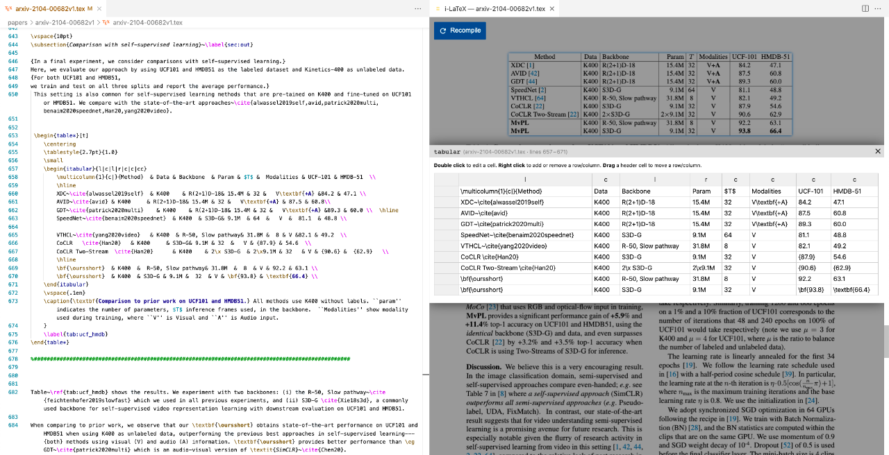

# The _i_-LaTeX editor

_i_-LaTeX is an extension that turns the [Visual Studio Code editor](https://code.visualstudio.com/) into a prototypal editor for [LaTeX](https://www.latex-project.org/) featuring _transitionals_, visual representations of fragments of code that can be manipulated interactively by clicking their output in the generated PDF.
The current version offers transitionals for mathematical formaluae, tables, images, and custom grid layouts.

> ⚠️ At the moment, _i_-LaTeX only supports MacOS and Linux, and does not support Windows. If you are interested in adapting the extension to make it work with Windows, please contact us!

## Installation

⬇️ [**Download the latest version of the extension (VSIX file)**](https://github.com/exsitu-projects/ilatex/raw/ci-vscode-extension/ilatex.vsix)

In order to use _i_-LaTeX, you must have the [Visual Studio Code editor](https://code.visualstudio.com/) and a recent distribution of LaTeX (such as [MacTeX](https://tug.org/mactex/) or [TeX Live](https://www.tug.org/texlive/)) with [`latexmk`](https://ctan.org/pkg/latexmk) installed on your system.

The extension is provided as a VSIX file that must be installed manually in Visual Studio Code, as explained in [this guide](https://code.visualstudio.com/docs/editor/extension-marketplace#_install-from-a-vsix).

## Usage

📖 [**Read the user guide for more detailed explanations**](./misc/user-guide.pdf)

### Compiling a document and displaying the generated PDF

In order to display a LaTeX document with _i_-LaTeX, you must (1) open the directory that contains all the files used by the document in Visual Studio Code and (2) open the main LaTeX document with _i_-LaTeX.

This last step can be performed by clicking the “_i_-LaTeX” button in the status bar, at the bottom of the editor's window, and either selecting the file that has the focus in the editor (_Create from the active editor_) or searching for the main LaTeX file of your document (_Create from file..._).

Once the file is selected, _i_-LaTeX will attempt to compile it.
If the compilation fails, an error message will be displayed, and invite you to review the logs.
If the compilation succeeds, the resulting PDF will be opened in a new panel.
Once the PDF has been displayed, you can manually recompile the document by clicking the button displayed on top of the PDF.

### Using transitionals

_i_-LaTeX currently features four kinds of transitionals, which require to use custom commands and environments in order to be detected by _i_-LaTeX. They are provided by the `ilatex.sty` package, which must be imported in your LaTeX document: put the file in the same directory, and use the `\usepackage{ilatex}` command.

The four transitionals are described in more details in the aformentioned manual. In a nutshell:

- Use the `imaths` environment for mathematical formulae (instead of `\[ … \]`, `equation`, `align`, etc)
- Use the `itabular` environment for tables (instead of `tabular`)
- Use the `\iincludegraphics` command for images (instead of `\includegraphics`, which has only one `i`!)
- Refer to the manual for information on the custom grid layout environements (they are experimental!)

Elements with transitionals will be surrounded with blue halos and can be clicked to display the transitionals.
The fragment of code represented by a transitional can be shown in the code editor by clicking the title bar of the transitional (with the name and the location of the code).
When a transitional is closed, the document is automatically recompiled, unless there was no change in the code.

If the code cannot be parsed by _i_-LaTeX (e.g., because of a syntax error), an error message will be displayed. If the error is located within a fragment of code represented by a transitional that is currently visible, the transitional will be replaced by an error message. It should be restored as soon as the error is fixed, though in some cases, you might have to recompile the document.

## Development

For technical details on how _i_-LaTeX works and how to extend it, such as for adding new kinds of transitionals, please refer to this [**technical guide**]().

## Publications

_i_-LaTeX is a research prototype developed by Camille Gobert during his PhD in the [ex)situ](https://ex-situ.lri.fr/) team (Paris-Saclay University, CNRS, Inria, Laboratoire Interdisciplinaire des Sciences du Numérique).
You can read more about _i_-LaTeX and the underlying concept of transitional in the following papers:

> [**Représentations intermédiaires interactives pour la manipulation de code LaTeX**](https://dl.acm.org/doi/10.1145/3450522.3451325)
> (Gobert & Beaudouin-Lafon, 2021), published at the IHM'20'21 conference (in French).

> [**_i_-LaTeX: Manipulating Transitional Representations between LaTeX Code and Generated Documents**](https://doi.org/10.1145/3491102.3517494)
> (Gobert & Beaudouin-Lafon, 2022), to be published at the ACM CHI 2022 conference.

## License and credits

The code of _i_-LaTeX is released under the MIT license.
You can freely use and adapt the code of _i_-LaTeX, and we'd be glad to hear about it if you do!

However, the licenses of some dependencies may be more restrictive. In addition to the dependencies listed in [`package.json`](./package.json) (such as [Rollup](https://rollupjs.org) for bundling the webview's code and [Parsimmon](https://github.com/jneen/parsimmon) for creating the parser), the webview of the extension uses a number of libraries that are _not_ listed as dependencies and are currently [part of the source code](./src/webview/template/static):

- [PDF.js](https://mozilla.github.io/pdf.js/) ([Apache 2.0 license](https://github.com/mozilla/pdf.js/blob/master/LICENSE))
- [KaTeX](https://katex.org/), customised to trace the where-provenance of symbols and groups of symbols (MIT license)
- [Handsontable](https://handsontable.com/), with a bug fix that prevented it from working ([non-commercial use license](https://github.com/handsontable/handsontable/blob/master/handsontable-non-commercial-license.pdf))
- [Interact.js](https://interactjs.io/) (MIT license)
- [Cropper.js](https://fengyuanchen.github.io/cropperjs/) (MIT license)
